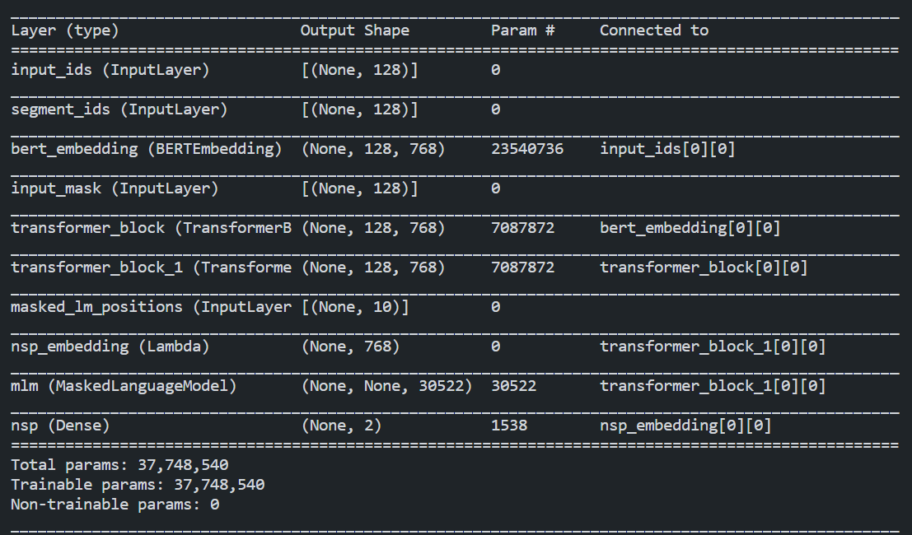
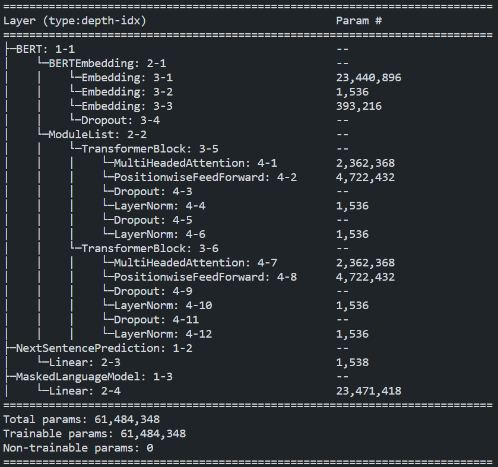

本项目简单记录学习bert模型，以及参考网上使用tensorflow2和pytorch简单实现。

### tensorflow2+keras实现
部分实现
```python
class BERTMLM(keras.Model):
    def __init__(self, vocab_size, hidden_size=768, maxlen=512, 
                num_layers=12, nums_heads=12, rate=0.1):
        super(BERTMLM, self).__init__()

        self.bert = BERT(vocab_size, hidden_size, maxlen, num_layers, nums_heads, rate)
        self.masked_language_model = MaskedLanguageModel(vocab_size=vocab_size, name="mlm")
        self.extract_nsp_embedding = layers.Lambda(lambda x: x[:,0], name="nsp_embedding")
        self.next_sentence = layers.Dense(2, activation='softmax', name="nsp")

    def call(self, inputs):
        input_ids, segment_ids, input_mask, masked_lm_positions, training = inputs

        seq_outputs, output_weights = self.bert([input_ids, segment_ids, input_mask, training])
        # MLM output
        mlm_output = self.masked_language_model(seq_outputs, masked_lm_positions, output_weights)
        # NSP output
        nsp_output = self.next_sentence(self.extract_nsp_embedding(seq_outputs))

        return seq_outputs, mlm_output, nsp_output
```
模型summary结果




### pytorch实现
部分实现
```python
class BERTLM(nn.Module):
    """
    BERT Language Model
    Next Sentence Prediction Model + Masked Language Model
    """
    def __init__(self, vocab_size, hidden=768, maxlen=512, 
                num_layers=12, attn_heads=12, dropout=0.1):
        super(BERTLM, self).__init__()
        
        self.bert = BERT(vocab_size, hidden, maxlen, num_layers, attn_heads, dropout)
        self.next_sentence = NextSentencePrediction(hidden)
        self.mask_lm = MaskedLanguageModel(hidden, vocab_size)
    
    def forward(self, x, segment_label, masked_lm_positions):
        out = self.bert(x, segment_label)
        nsp_out = self.next_sentence(out)
        mlm_out = self.mask_lm(out, masked_lm_positions)
        print(nsp_out.size(), mlm_out.size())
        return nsp_out, mlm_out
```
模型summary结果

需要安装: pip install torchinfo


